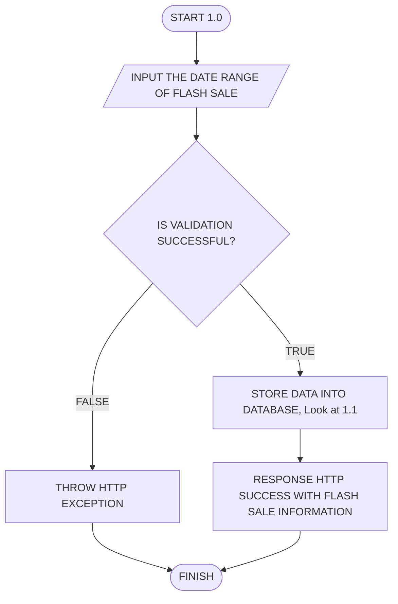
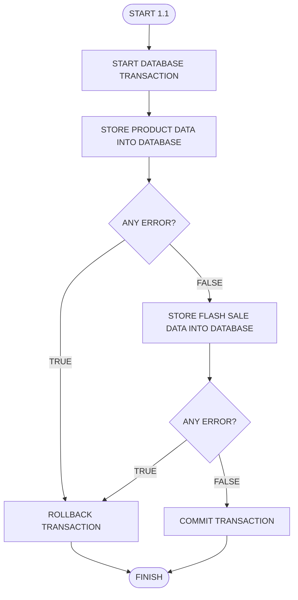
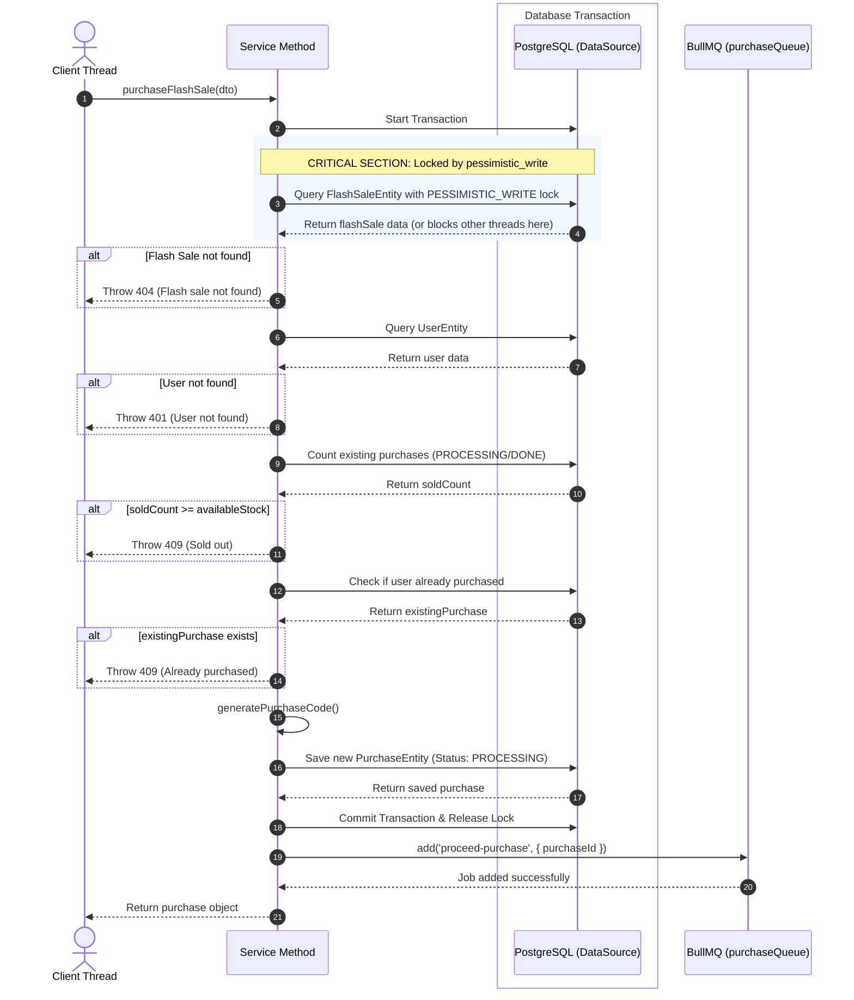

# Flash Sale Service

A simple Flash Sale service built with:

- NestJS
- TypeScript
- PostgreSQL
- Redis
- TypeORM
- BullMQ

The purpose of this project is to demonstrate a basic flash sale system with stock protection, transaction handling, queue-based processing, and pessimistic locking to prevent overselling.

---

# Prerequisites

Before running the application, ensure you have:

- Node.js
- npm
- Docker
- Docker Compose

---

# Getting Started

## 1. Start Infrastructure

Spin up PostgreSQL and Redis using Docker.

You may use either syntax depending on your Docker version:

```bash
docker compose up -d
```

or

```bash
docker-compose up -d
```

---

## 2. Install Dependencies

```bash
npm i
```

---

## 3. Run Application

Development mode:

```bash
npm run start:dev
```

Production mode:

```bash
npm run start
```

At this point the service is ready for testing.

---

# Common Scripts

## Run Application

```bash
npm run start
```

Starts the NestJS application.

---

```bash
npm run start:dev
```

Starts the application in watch mode.

---

## Run Tests

```bash
npm run test:watch
```

Runs Jest in watch mode.

---

```bash
npm run test:cov
```

Generates test coverage report.

---

```bash
npm run test:stress
```

Run stress test.

---

# API Endpoints

## Authentication

### Login Attempt

**Endpoint**

```http
POST /auth/login-attempt
```

**Controller Method**

```typescript
loginAttempt();
```

**Description**

Authenticate user credentials and return access information.

---

## User

### Register User

**Endpoint**

```http
POST /user/register
```

**Controller Method**

```typescript
register();
```

**Description**

Register a new user.

---

## Flash Sale

### Create Flash Sale

**Endpoint**

```http
POST /flash-sale
```

**Controller Method**

```typescript
create();
```

**Description**

Create a new flash sale.

---

### Purchase Flash Sale

**Endpoint**

```http
POST /flash-sale/purchase
```

**Controller Method**

```typescript
purchaseFlashSale();
```

**Description**

Purchase an item from an active flash sale.

Requires authenticated user.

---

### Get Active Flash Sale

**Endpoint**

```http
GET /flash-sale
```

**Controller Method**

```typescript
getActive();
```

**Description**

Retrieve today's active flash sale.

Requires authenticated user.

---

### Get Recent Flash Sale

**Endpoint**

```http
GET /flash-sale/recent
```

**Controller Method**

```typescript
getRecent();
```

**Description**

Retrieve the most recently completed flash sale.

---

### Get Upcoming Flash Sale

**Endpoint**

```http
GET /flash-sale/upcoming
```

**Controller Method**

```typescript
getUpcoming();
```

**Description**

Retrieve the next scheduled flash sale.

---

# High Level Architecture

```text
Client
   │
   ▼
NestJS API
   │
   ├── PostgreSQL (TypeORM)
   │
   ├── Redis
   │
   └── BullMQ
```

---

# Flash Sale Creation Flow

The following diagram illustrates the high-level flow when creating a flash sale.



---

# Flash Sale Creation Transaction Flow

This process is executed inside a database transaction to ensure consistency.



---

# Purchase Flow

The purchase operation is protected using:

- Database Transaction
- Pessimistic Locking
- Duplicate Purchase Validation
- Stock Validation
- Queue-Based Processing



---

# Transaction Strategy

## Flash Sale Creation

All database writes are wrapped in a single transaction.

If any operation fails:

```text
ROLLBACK TRANSACTION
```

No partial data will be persisted.

---

## Flash Sale Purchase

The purchase operation uses:

```text
PESSIMISTIC_WRITE
```

to lock the flash sale record and prevent race conditions during high traffic.

This ensures:

- No overselling
- No duplicate purchases
- Consistent stock calculation

---

# Purchase Processing Strategy

When a purchase request succeeds:

1. Database transaction begins.
2. Flash sale row is locked using pessimistic locking.
3. Purchase record is created with status:

```text
PROCESSING
```

4. Transaction is committed.
5. Lock is released.
6. Purchase job is pushed into BullMQ.
7. Worker processes the purchase asynchronously.
8. Purchase status becomes:

```text
DONE
```

Important:

The BullMQ job must only be published **after the database transaction has been successfully committed**.

This guarantees that workers never receive jobs for records that were rolled back.

---

# Technologies Used

| Technology | Purpose                   |
| ---------- | ------------------------- |
| NestJS     | Backend Framework         |
| TypeScript | Programming Language      |
| PostgreSQL | Primary Database          |
| TypeORM    | ORM                       |
| Redis      | Queue Backend             |
| BullMQ     | Background Job Processing |
| Jest       | Testing Framework         |

---

# Future Improvements

Potential enhancements:

- JWT Authentication
- Swagger/OpenAPI Documentation
- Rate Limiting
- Distributed Locking
- Event-Driven Architecture
- Metrics & Monitoring
- Dead Letter Queue (DLQ)
- Purchase Cancellation Flow

---
